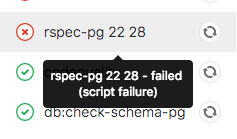
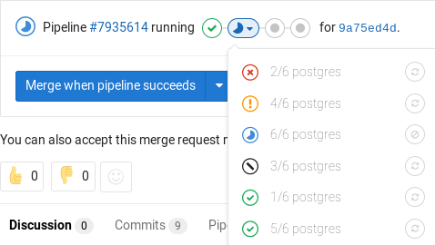
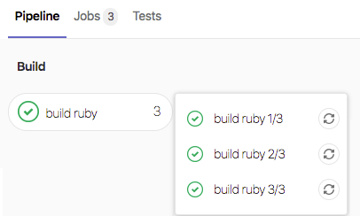
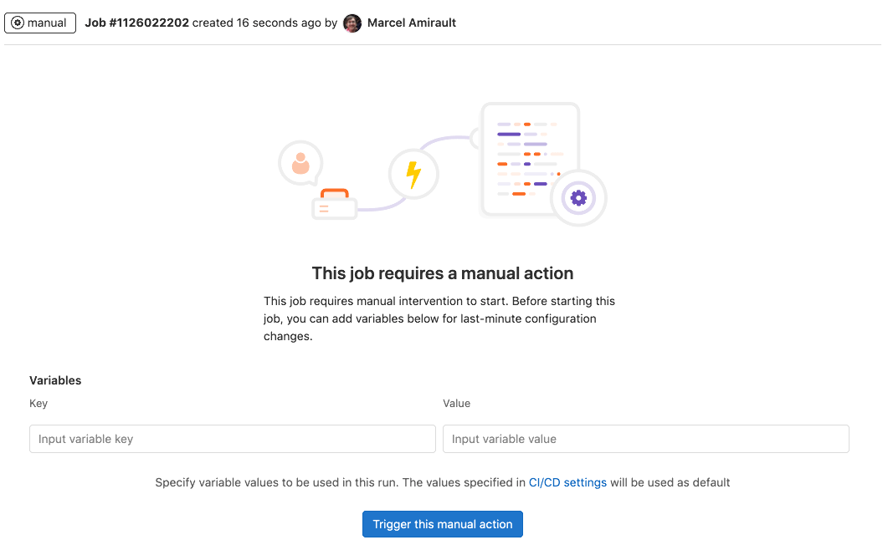
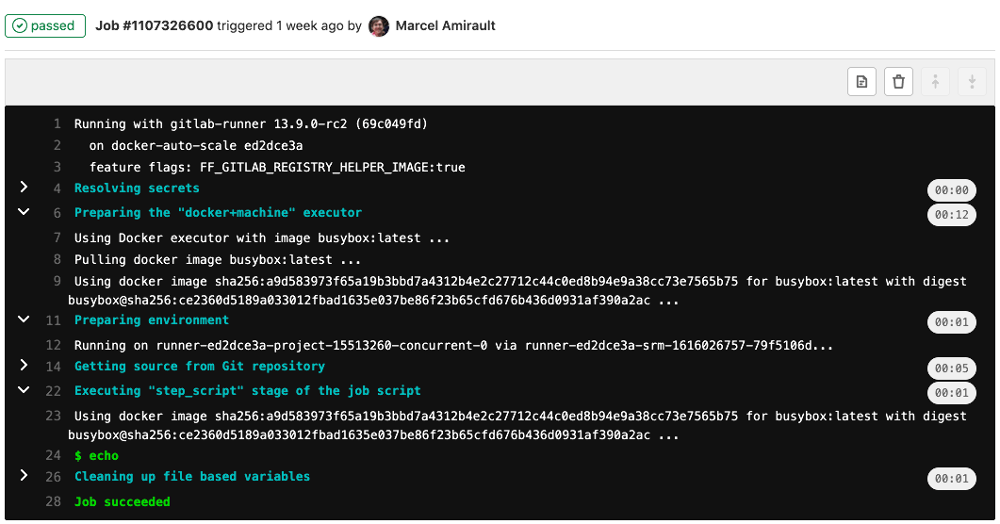

# Jobs **(FREE)**

Pipeline configuration begins with jobs. Jobs are the most fundamental element of a `.gitlab-ci.yml` file.

Jobs are:

- Defined with constraints stating under what conditions they should be executed.
- Top-level elements with an arbitrary name and must contain at least the [`script`](../yaml/index.md#script) clause.
- Not limited in how many can be defined.

For example:

```yaml
job1:
  script: "execute-script-for-job1"

job2:
  script: "execute-script-for-job2"
```

The above example is the simplest possible CI/CD configuration with two separate
jobs, where each of the jobs executes a different command.
Of course a command can execute code directly (`./configure;make;make install`)
or run a script (`test.sh`) in the repository.

Jobs are picked up by [runners](../runners/index.md) and executed in the
environment of the runner. What is important is that each job is run
independently from each other.

## View jobs in a pipeline

When you access a pipeline, you can see the related jobs for that pipeline.

Clicking an individual job shows you its job log, and allows you to:

- Cancel the job.
- Retry the job.
- Erase the job log.

## See why a job failed

> [Introduced](https://gitlab.com/gitlab-org/gitlab-foss/-/merge_requests/17782) in GitLab 10.7.

When a pipeline fails or is allowed to fail, there are several places where you
can find the reason:

- In the [pipeline graph](../pipelines/index.md#visualize-pipelines), on the pipeline detail view.
- In the pipeline widgets, in the merge requests and commit pages.
- In the job views, in the global and detailed views of a job.

In each place, if you hover over the failed job you can see the reason it failed.



In [GitLab 10.8](https://gitlab.com/gitlab-org/gitlab-foss/-/merge_requests/17814) and later,
you can also see the reason it failed on the Job detail page.

## The order of jobs in a pipeline

The order of jobs in a pipeline depends on the type of pipeline graph.

- For [full pipeline graphs](../pipelines/index.md#view-full-pipeline-graph), jobs are sorted by name.
- For [pipeline mini graphs](../pipelines/index.md#pipeline-mini-graphs), jobs are sorted by severity and then by name.

The order of severity is:

- failed
- warning
- pending
- running
- manual
- scheduled
- canceled
- success
- skipped
- created

For example:



## Group jobs in a pipeline

> [Introduced](https://gitlab.com/gitlab-org/gitlab-foss/-/merge_requests/6242) in GitLab 8.12.

If you have many similar jobs, your [pipeline graph](../pipelines/index.md#visualize-pipelines) becomes long and hard
to read.

You can automatically group similar jobs together. If the job names are formatted in a certain way,
they are collapsed into a single group in regular pipeline graphs (not the mini graphs).

You can recognize when a pipeline has grouped jobs if you don't see the retry or
cancel button inside them. Hovering over them shows the number of grouped
jobs. Click to expand them.


To create a group of jobs, in the [CI/CD pipeline configuration file](../yaml/index.md),
separate each job name with a number and one of the following:

- A slash (`/`), for example, `test 1/3`, `test 2/3`, `test 3/3`.
- A colon (`:`), for example, `test 1:3`, `test 2:3`, `test 3:3`.
- A space, for example `test 0 3`, `test 1 3`, `test 2 3`.

You can use these symbols interchangeably.

In the example below, these three jobs are in a group named `build ruby`:

```yaml
build ruby 1/3:
  stage: build
  script:
    - echo "ruby1"

build ruby 2/3:
  stage: build
  script:
    - echo "ruby2"

build ruby 3/3:
  stage: build
  script:
    - echo "ruby3"
```

In the pipeline, the result is a group named `build ruby` with three jobs:



The jobs are ordered by comparing the numbers from left to right. You
usually want the first number to be the index and the second number to be the total.

[This regular expression](https://gitlab.com/gitlab-org/gitlab/-/blob/2f3dc314f42dbd79813e6251792853bc231e69dd/app/models/commit_status.rb#L99)
evaluates the job names: `([\b\s:]+((\[.*\])|(\d+[\s:\/\\]+\d+)))+\s*\z`.
One or more `: [...]`, `X Y`, `X/Y`, or `X\Y` sequences are removed from the **end**
of job names only. Matching substrings found at the beginning or in the middle of
job names are not removed.

In [GitLab 13.8 and earlier](https://gitlab.com/gitlab-org/gitlab/-/merge_requests/52644),
the regular expression is `\d+[\s:\/\\]+\d+\s*`. [Feature flag](../../user/feature_flags.md)
removed in [GitLab 13.11](https://gitlab.com/gitlab-org/gitlab/-/issues/322080).

## Specifying variables when running manual jobs

> [Introduced](https://gitlab.com/gitlab-org/gitlab-foss/-/merge_requests/30485) in GitLab 12.2.

When running manual jobs you can supply additional job specific variables.

You can do this from the job page of the manual job you want to run with
additional variables. To access this page, click on the **name** of the manual job in
the pipeline view, *not* the play (**{play}**) button.

This is useful when you want to alter the execution of a job that uses
[custom CI/CD variables](../variables/index.md#custom-cicd-variables).
Add a variable name (key) and value here to override the value defined in
[the UI or `.gitlab-ci.yml`](../variables/index.md#custom-cicd-variables),
for a single run of the manual job.



## Delay a job

> [Introduced](https://gitlab.com/gitlab-org/gitlab-foss/-/merge_requests/21767) in GitLab 11.4.

When you do not want to run a job immediately, you can use the [`when:delayed`](../jobs/job_control.md#run-a-job-after-a-delay) keyword to
delay a job's execution for a certain period.

This is especially useful for timed incremental rollout where new code is rolled out gradually.

For example, if you start rolling out new code and:

- Users do not experience trouble, GitLab can automatically complete the deployment from 0% to 100%.
- Users experience trouble with the new code, you can stop the timed incremental rollout by canceling the pipeline
  and [rolling](../environments/index.md#retry-or-roll-back-a-deployment) back to the last stable version.


## Expand and collapse job log sections

> [Introduced](https://gitlab.com/gitlab-org/gitlab-foss/-/issues/14664) in GitLab 12.0.

Job logs are divided into sections that can be collapsed or expanded. Each section displays
the duration.

In the following example:

- Three sections are collapsed and can be expanded.
- Three sections are expanded and can be collapsed.



### Custom collapsible sections

> [Introduced](https://gitlab.com/gitlab-org/gitlab-foss/-/issues/14664) in GitLab 12.0.

You can create [collapsible sections in job logs](#expand-and-collapse-job-log-sections)
by manually outputting special codes
that GitLab uses to determine what sections to collapse:

- Section start marker: `\e[0Ksection_start:UNIX_TIMESTAMP:SECTION_NAME\r\e[0K` + `TEXT_OF_SECTION_HEADER`
- Section end marker: `\e[0Ksection_end:UNIX_TIMESTAMP:SECTION_NAME\r\e[0K`

You must add these codes to the script section of the CI configuration. For example,
using `echo`:

```yaml
job1:
  script:
    - echo -e "\e[0Ksection_start:`date +%s`:my_first_section\r\e[0KHeader of the 1st collapsible section"
    - echo 'this line should be hidden when collapsed'
    - echo -e "\e[0Ksection_end:`date +%s`:my_first_section\r\e[0K"
```

Depending on the shell that your runner uses, for example if it is using ZSH, you may need to
escape the special characters like so: `\\e` and `\\r`.

In the example above:

- `date +%s`: The Unix timestamp (for example `1560896352`).
- `my_first_section`: The name given to the section.
- `\r\e[0K`: Prevents the section markers from displaying in the rendered (colored)
  job log, but they are displayed in the raw job log. To see them, in the top right
  of the job log, click **{doc-text}** (**Show complete raw**).
  - `\r`: carriage return.
  - `\e[0K`: clear line ANSI escape code.

Sample raw job log:

```plaintext
\e[0Ksection_start:1560896352:my_first_section\r\e[0KHeader of the 1st collapsible section
this line should be hidden when collapsed
\e[0Ksection_end:1560896353:my_first_section\r\e[0K
```

### Pre-collapse sections

> [Introduced](https://gitlab.com/gitlab-org/gitlab/-/issues/198413) in GitLab 13.5.

You can make the job log automatically collapse collapsible sections by adding the `collapsed` option to the section start.
Add `[collapsed=true]` after the section name and before the `\r`. The section end marker
remains unchanged:

- Section start marker with `[collapsed=true]`: `\e[0Ksection_start:UNIX_TIMESTAMP:SECTION_NAME[collapsed=true]\r\e[0K` + `TEXT_OF_SECTION_HEADER`
- Section end marker: `section_end:UNIX_TIMESTAMP:SECTION_NAME\r\e[0K`

Add the updated section start text to the CI configuration. For example,
using `echo`:

```yaml
job1:
  script:
    - echo -e "\e[0Ksection_start:`date +%s`:my_first_section[collapsed=true]\r\e[0KHeader of the 1st collapsible section"
    - echo 'this line should be hidden automatically after loading the job log'
    - echo -e "\e[0Ksection_end:`date +%s`:my_first_section\r\e[0K"
```

## Deployment jobs

Deployment jobs are a specific kind of CI job in that they deploy code to
[environments](../environments/index.md). A deployment job is any job that
uses the `environment` keyword and the [`start` environment `action`](../yaml/index.md#environmentaction).
Deployment jobs do not need to be in the `deploy` stage. The following `deploy me`
job is an example of a deployment job. `action: start` is the default behavior and
is defined for the sake of the example, but you can omit it:

```yaml
deploy me:
  script:
    - deploy-to-cats.sh
  environment:
    name: production
    url: https://cats.example.com
    action: start
```

The behavior of deployment jobs can be controlled with
[deployment safety](../environments/deployment_safety.md) settings like
[skipping outdated deployment jobs](../environments/deployment_safety.md#prevent-deployments-during-deploy-freeze-windows)
and [ensuring only one deployment job runs at a time](../environments/deployment_safety.md#ensure-only-one-deployment-job-runs-at-a-time).
