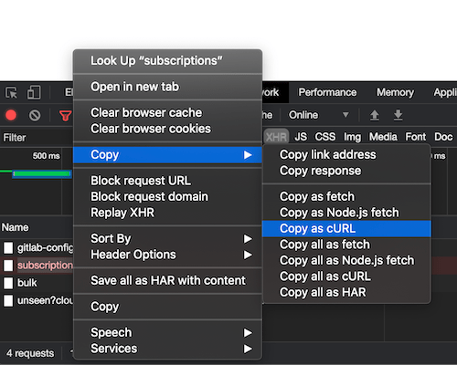
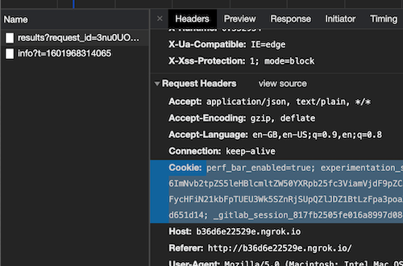

# Set up a development environment **(FREE)**

The following are required to install and test the app:

- A Jira Cloud instance. Atlassian provides [free instances for development and testing](https://developer.atlassian.com/platform/marketplace/getting-started/#free-developer-instances-to-build-and-test-your-app).
- A GitLab instance available over the internet. For the app to work, Jira Cloud should
  be able to connect to the GitLab instance through the internet. For this we
  recommend using Gitpod or a similar cloud development environment. For more
  information on using Gitpod with GDK, see the:

  - [GDK in Gitpod](https://www.loom.com/share/9c9711d4876a40869b9294eecb24c54d)
    video.
  - [GDK with Gitpod](https://gitlab.com/gitlab-org/gitlab-development-kit/-/blob/main/doc/howto/gitpod.md)
    documentation.

  <!-- vale gitlab.Spelling = NO -->

  You **must not** use tunneling tools such as Serveo or `ngrok`. These are
  security risks, and must not be run on developer laptops.

  <!-- vale gitlab.Spelling = YES -->

  Jira requires all connections to the app host to be over SSL. If you set up
  your own environment, remember to enable SSL and an appropriate certificate.

## Install the app in Jira

To install the app in Jira:

1. Enable Jira development mode to install apps that are not from the Atlassian
   Marketplace:

   1. In Jira, navigate to **Jira settings > Apps > Manage apps**.
   1. Scroll to the bottom of the **Manage apps** page and click **Settings**.
   1. Select **Enable development mode** and click **Apply**.

1. Install the app:

   1. In Jira, navigate to **Jira settings > Apps > Manage apps**.
   1. Click **Upload app**.
   1. In the **From this URL** field, provide a link to the app descriptor. The host and port must point to your GitLab instance.

      For example:

      ```plaintext
      https://xxxx.gitpod.io/-/jira_connect/app_descriptor.json
      ```

   1. Click **Upload**.

   If the install was successful, you should see the **GitLab for Jira** app under **Manage apps**.
   You can also click **Getting Started** to open the configuration page rendered from your GitLab instance.

   _Note that any changes to the app descriptor requires you to uninstall then reinstall the app._

### Troubleshooting

If the app install failed, you might need to delete `jira_connect_installations` from your database.

1. Open the [database console](https://gitlab.com/gitlab-org/gitlab-development-kit/-/blob/main/doc/howto/postgresql.md#access-postgresql).
1. Run `TRUNCATE TABLE jira_connect_installations CASCADE;`.

## Add a namespace

To add a [namespace](../../user/group/index.md#namespaces) to Jira:

1. Make sure you are logged in on your GitLab development instance.
1. On the GitLab app page in Jira, click **Get started**.
1. Open your browser's developer tools and navigate to the **Network** tab.
1. Try to add the namespace in Jira.
1. If the request fails with 401 "not authorized", copy the request as a cURL command
   and paste it in your terminal.

   

1. Go to your development instance (usually at: <http://localhost:3000>), open developer
   tools, navigate to the Network tab and reload the page.
1. Copy all cookies from the first request.

   

1. Append the cookies to the cURL command in your terminal:
   `--cookies "<cookies from the request>"`.
1. Submit the cURL request.
1. If the response is `{"success":true}`, the namespace was added.
1. Append the cookies to the cURL command in your terminal `--cookies "PASTE COOKIES HERE"`.
1. Submit the cURL request.
1. If the response is `{"success":true}` the namespace was added.
