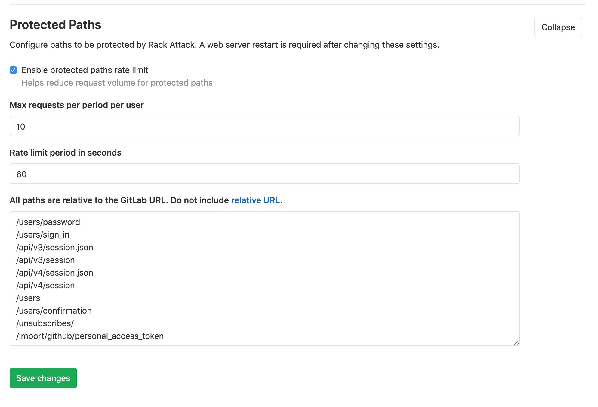

# Protected paths **(FREE SELF)**

Rate limiting is a common technique used to improve the security and durability
of a web application. For more details, see
[Rate limits](../../../security/rate_limits.md).

GitLab rate limits the following paths with Rack Attack by default:

```plaintext
'/users/password',
'/users/sign_in',
'/api/#{API::API.version}/session.json',
'/api/#{API::API.version}/session',
'/users',
'/users/confirmation',
'/unsubscribes/',
'/import/github/personal_access_token',
'/admin/session'
```

GitLab responds with HTTP status code `429` to POST requests at protected paths
that exceed 10 requests per minute per IP address.

See [User and IP rate limits](../../admin_area/settings/user_and_ip_rate_limits.md#response-headers) for the headers responded to blocked requests.

For example, the following are limited to a maximum 10 requests per minute:

- User sign-in
- User sign-up (if enabled)
- User password reset

After 10 requests, the client must wait 60 seconds before it can
try again.

## Configure using GitLab UI

> Introduced in [GitLab 12.4](https://gitlab.com/gitlab-org/gitlab-foss/-/merge_requests/31246).

Throttling of protected paths is enabled by default and can be disabled or
customized on **Admin > Network > Protected Paths**, along with these options:

- Maximum number of requests per period per user.
- Rate limit period in seconds.
- Paths to be protected.



Requests over the rate limit are logged into `auth.log`.
