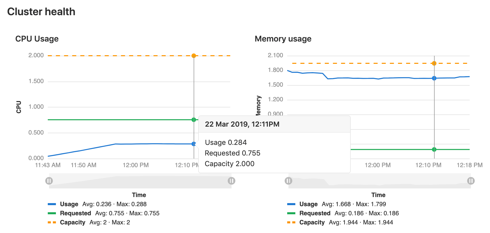

# Kubernetes clusters **(FREE)**

> - [Introduced](https://gitlab.com/gitlab-org/gitlab-foss/-/issues/35954) in GitLab 10.1 for projects.
> - [Introduced](https://gitlab.com/gitlab-org/gitlab-foss/-/issues/34758) in
>   GitLab 11.6 for [groups](../../group/clusters/index.md).
> - [Introduced](https://gitlab.com/gitlab-org/gitlab-foss/-/issues/39840) in
>   GitLab 11.11 for [instances](../../instance/clusters/index.md).

We offer extensive integrations to help you connect and manage your Kubernetes clusters from GitLab.

Read through this document to get started.

## Clusters infrastructure

Use [Infrastructure as Code](../../infrastructure) to create and manage your clusters with the GitLab integration with Terraform.

## Benefit from the GitLab-Kubernetes integration

Using the GitLab-Kubernetes integration, you can benefit of GitLab
features such as:

- Create [CI/CD Pipelines](../../../ci/pipelines/index.md) to build, test, and deploy to your cluster.
- Use [Auto DevOps](#auto-devops) to automate the CI/CD process.
- Use [role-based or attribute-based access controls](cluster_access.md).
- Run serverless workloads on [Kubernetes with Knative](serverless/index.md).
- Connect GitLab to in-cluster applications using [cluster integrations](../../clusters/integrations.md).
- Use [Deploy Boards](../deploy_boards.md) to see the health and status of each CI [environment](../../../ci/environments/index.md) running on your Kubernetes cluster.
- Use [Canary deployments](../canary_deployments.md) to update only a portion of your fleet with the latest version of your application.
- View your [Kubernetes podlogs](kubernetes_pod_logs.md) directly in GitLab.
- Connect to your cluster through GitLab [web terminals](deploy_to_cluster.md#web-terminals-for-kubernetes-clusters).

## Supported cluster versions

GitLab is committed to support at least two production-ready Kubernetes minor
versions at any given time. We regularly review the versions we support, and
provide a three-month deprecation period before we remove support of a specific
version. The range of supported versions is based on the evaluation of:

- The versions supported by major managed Kubernetes providers.
- The versions [supported by the Kubernetes community](https://kubernetes.io/releases/version-skew-policy/#supported-versions).

GitLab supports the following Kubernetes versions, and you can upgrade your
Kubernetes version to any supported version at any time:

- 1.19 (support ends on February 22, 2022)
- 1.18 (support ends on November 22, 2021)
- 1.17 (support ends on September 22, 2021)
- 1.16 (support ends on July 22, 2021)
- 1.15 (support ends on May 22, 2021)

Some GitLab features may support versions outside the range provided here.

## Add and remove clusters

You can create new or add existing clusters to GitLab:

- On the project-level, to have a cluster dedicated to a project.
- On the [group level](../../group/clusters/index.md), to use the same cluster across multiple projects within your group.
- On the [instance level](../../instance/clusters/index.md), to use the same cluster across multiple groups and projects. **(FREE SELF)**

To create new clusters, use one of the following methods:

- [Infrastructure as Code](../../infrastructure/index.md) (**recommended**).
- [Cluster certificates](add_remove_clusters.md) (**deprecated**).

You can also [add existing clusters](add_existing_cluster.md) to GitLab.

## View your clusters

To view your project-level Kubernetes clusters, to go **Infrastructure > Kubernetes clusters**
from your project. On this page, you can add a new cluster
and view information about your existing clusters, such as:

- Nodes count.
- Rough estimates of memory and CPU usage.

## Configuring your Kubernetes cluster

Use the [GitLab Kubernetes Agent](../../clusters/agent/index.md) to safely
configure your clusters. Otherwise, there are [security implications](#security-implications).

### Security implications

WARNING:
The whole cluster security is based on a model where [developers](../../permissions.md)
are trusted, so **only trusted users should be allowed to control your clusters**.

The default cluster configuration grants access to a wide set of
functionalities needed to successfully build and deploy a containerized
application. Bear in mind that the same credentials are used for all the
applications running on the cluster.

## Multiple Kubernetes clusters

See how to associate [multiple Kubernetes clusters](multiple_kubernetes_clusters.md)
with your GitLab project.

## Cluster integrations

See the available [cluster integrations](../../clusters/integrations.md)
to integrate third-party applications with your clusters through GitLab.

## Cluster management project

Attach a [Cluster management project](../../clusters/management_project.md)
to your cluster to manage shared resources requiring `cluster-admin` privileges for
installation, such as an Ingress controller.

## GitLab-managed clusters

See how to allow [GitLab to manage your cluster for you](gitlab_managed_clusters.md).

## Auto DevOps

You can use [Auto DevOps](../../../topics/autodevops/index.md) to automatically
detect, build, test, deploy, and monitor your applications.

## Deploying to a Kubernetes cluster

See how to [deploy to your Kubernetes cluster](deploy_to_cluster.md) from GitLab.

## Monitoring your Kubernetes cluster

Automatically detect and monitor Kubernetes metrics. Automatic monitoring of
[NGINX Ingress](../integrations/prometheus_library/nginx.md) is also supported.

[Read more about Kubernetes monitoring](../integrations/prometheus_library/kubernetes.md)

### Visualizing cluster health

> - [Introduced](https://gitlab.com/gitlab-org/gitlab/-/merge_requests/4701) in [GitLab Ultimate](https://about.gitlab.com/pricing/) 10.6.
> - [Moved](https://gitlab.com/gitlab-org/gitlab/-/issues/208224) to GitLab Free in 13.2.

When [the Prometheus cluster integration is enabled](../../clusters/integrations.md#prometheus-cluster-integration), GitLab monitors the cluster's health. At the top of the cluster settings page, CPU and Memory utilization is displayed, along with the total amount available. Keeping an eye on cluster resources can be important, if the cluster runs out of memory pods may be shutdown or fail to start.

