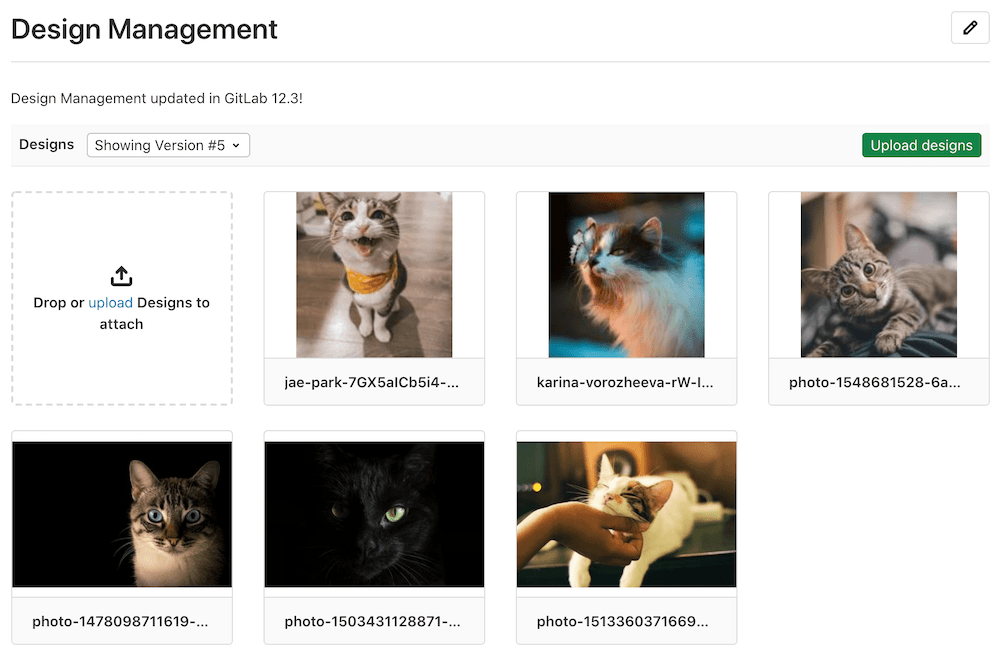
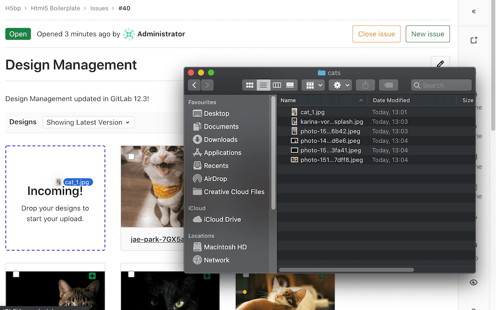
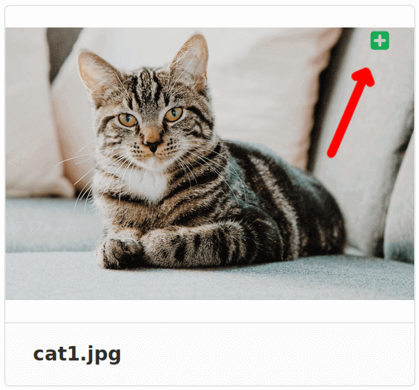
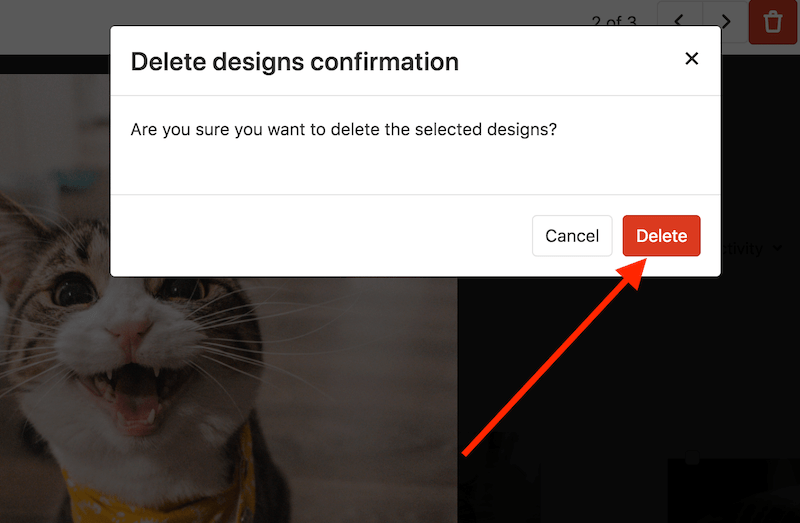
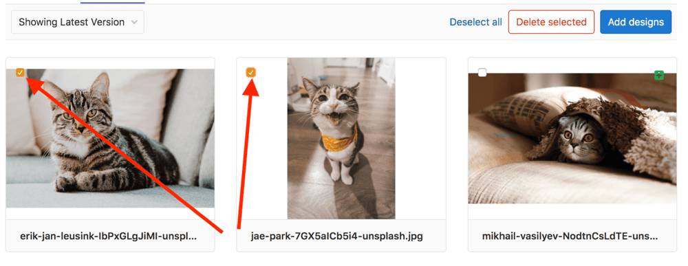
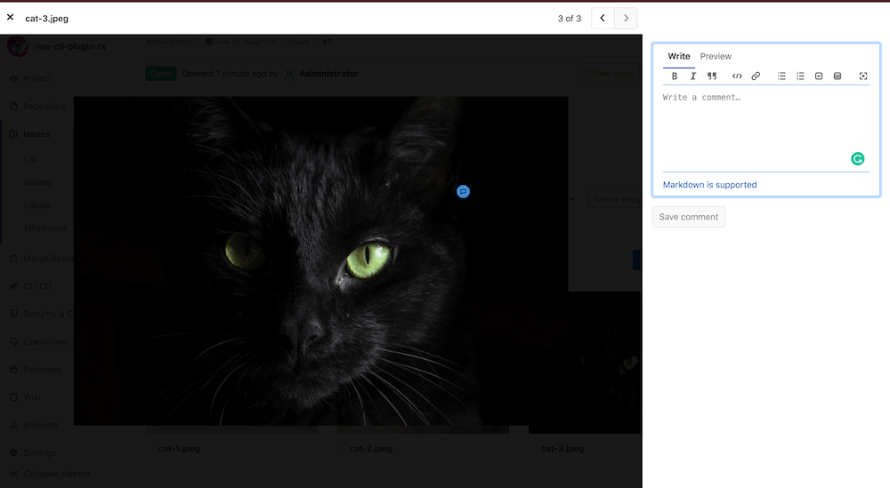
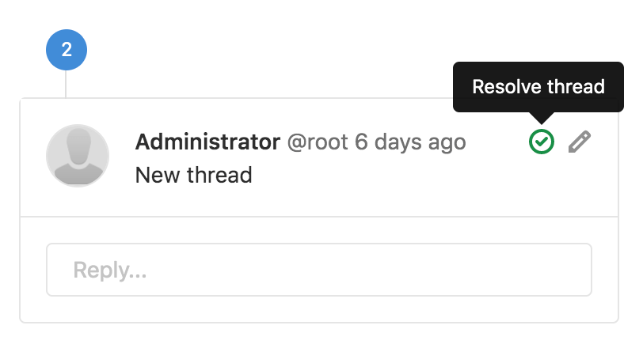
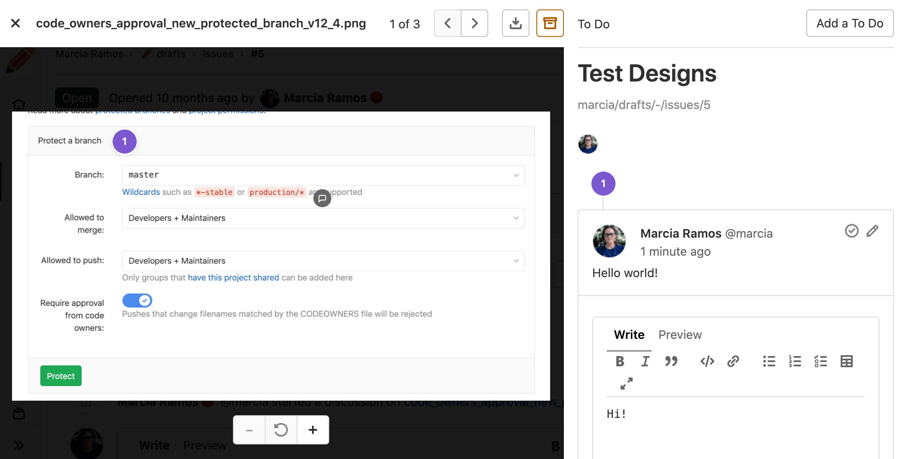

# Design Management **(FREE)**

> - [Introduced](https://gitlab.com/groups/gitlab-org/-/epics/660) in [GitLab Premium](https://about.gitlab.com/pricing/) 12.2.
> - Support for SVGs was [introduced](https://gitlab.com/gitlab-org/gitlab/-/issues/12771) in [GitLab Premium](https://about.gitlab.com/pricing/) 12.4.
> - Design Management was [moved](https://gitlab.com/gitlab-org/gitlab/-/issues/212566) to GitLab Free in 13.0.

Design Management allows you to upload design assets (wireframes, mockups, etc.)
to GitLab issues and keep them stored in one single place, accessed by the Design
Management's page within an issue, giving product designers, product managers, and engineers a
way to collaborate on designs over one single source of truth.

You can easily share mock-ups of designs with your team, or visual regressions can be easily
viewed and addressed.

<i class="fa fa-youtube-play youtube" aria-hidden="true"></i>
For an overview, see the video [Design Management (GitLab 12.2)](https://www.youtube.com/watch?v=CCMtCqdK_aM).

## Requirements

Design Management requires
[Large File Storage (LFS)](../../../topics/git/lfs/index.md)
to be enabled:

- For GitLab.com, LFS is already enabled.
- For self-managed instances, a GitLab administrator must have
  [enabled LFS globally](../../../administration/lfs/index.md).
- For both GitLab.com and self-managed instances: LFS must be enabled for the project itself.
  If enabled globally, LFS is enabled by default to all projects. To enable LFS on the
  project level, navigate to your project's **Settings > General**, expand **Visibility, project features, permissions**
  and enable **Git Large File Storage**.

Design Management also requires that projects are using
[hashed storage](../../../administration/raketasks/storage.md#migrate-to-hashed-storage). Since
 GitLab 10.0, newly created projects use hashed storage by default. A GitLab administrator can verify the storage type of a
project by navigating to **Admin Area > Projects** and then selecting the project in question.
A project can be identified as hashed-stored if its *Gitaly relative path* contains `@hashed`.

If the requirements are not met, the **Designs** tab displays a message to the user.

## Supported files

Files uploaded must have a file extension of either `png`, `jpg`, `jpeg`,
`gif`, `bmp`, `tiff`, `ico`, `webp`, or `svg`.

Support for PDF is tracked [in this issue](https://gitlab.com/gitlab-org/gitlab/-/issues/32811).

## Limitations

- Design uploads are limited to 10 files at a time.
- From GitLab 13.1, Design filenames are limited to 255 characters.
- Design Management data
  [isn't deleted when a project is destroyed](https://gitlab.com/gitlab-org/gitlab/-/issues/13429) yet.
- Design Management data [isn't deleted](https://gitlab.com/gitlab-org/gitlab/-/issues/13427)
  when an issue is deleted.
- From GitLab 12.7, Design Management data [can be replicated](../../../administration/geo/replication/datatypes.md#limitations-on-replicationverification)
  by Geo but [not verified](https://gitlab.com/gitlab-org/gitlab/-/issues/32467).
- Only the latest version of the designs can be deleted.
- Deleted designs cannot be recovered but you can see them on previous designs versions.

## GitLab-Figma plugin

> [Introduced](https://gitlab.com/gitlab-org/gitlab-figma-plugin/-/issues/2) in GitLab 13.2.

Connect your design environment with your source code management in a seamless workflow. The GitLab-Figma plugin makes it quick and easy to collaborate in GitLab by bringing the work of product designers directly from Figma to GitLab Issues as uploaded Designs.

To use the plugin, install it from the [Figma Directory](https://www.figma.com/community/plugin/860845891704482356)
and connect to GitLab through a personal access token. The details are explained in the [plugin documentation](https://gitlab.com/gitlab-org/gitlab-figma-plugin/-/wikis/home).

## The Design Management section

> - [Introduced](https://gitlab.com/gitlab-org/gitlab/-/issues/223193) in GitLab 13.2, Designs are displayed directly on the issue description rather than on a separate tab.
> - New display's feature flag [removed](https://gitlab.com/gitlab-org/gitlab/-/issues/223197) in GitLab 13.4.

You can find to the **Design Management** section in the issue description:



## Adding designs

To upload Design images, drag files from your computer and drop them in the Design Management section,
or click **upload** to select images from your file browser:


[Introduced](https://gitlab.com/gitlab-org/gitlab/-/issues/34353) in [GitLab Premium](https://about.gitlab.com/pricing/) 12.9,
you can drag and drop designs onto the dedicated drop zone to upload them.



[Introduced](https://gitlab.com/gitlab-org/gitlab/-/issues/202634)
in GitLab 12.10, you can also copy images from your file system and
paste them directly on the GitLab Design page as a new design.

On macOS you can also take a screenshot and immediately copy it to
the clipboard by simultaneously clicking <kbd>Control</kbd> + <kbd>Command</kbd> + <kbd>Shift</kbd> + <kbd>3</kbd>, and then paste it as a design.

Copy-and-pasting has some limitations:

- You can paste only one image at a time. When copy/pasting multiple files, only the first one is uploaded.
- All images are converted to `png` format under the hood, so when you want to copy/paste `gif` file, it results in broken animation.
- If you are pasting a screenshot from the clipboard, it is renamed to `design_<timestamp>.png`
- Copy/pasting designs is not supported on Internet Explorer.

Designs with the same filename as an existing uploaded design create a new version
of the design, and replaces the previous version. [Introduced](https://gitlab.com/gitlab-org/gitlab/-/issues/34353) in [GitLab Premium](https://about.gitlab.com/pricing/) 12.9, dropping a design on an existing uploaded design also creates a new version,
provided the filenames are the same.

### Skipped designs

Designs with the same filename as an existing uploaded design _and_ whose content has not changed are skipped.
This means that no new version of the design is created. When designs are skipped, you are made aware via a warning
message on the Issue.

## Viewing designs

Images on the Design Management page can be enlarged by clicking on them.
You can navigate through designs by clicking on the navigation buttons on the
top-right corner or with <kbd>Left</kbd>/<kbd>Right</kbd> keyboard buttons.

The number of discussions on a design — if any — is listed to the right
of the design filename. Clicking on this number enlarges the design
just like clicking anywhere else on the design.
When a design is added or modified, an icon is displayed on the item
to help summarize changes between versions.

| Indicator | Example |
| --------- | ------- |
| Discussions |  |
| Modified (in the selected version) |  |
| Added (in the selected version) |  |

### Exploring designs by zooming

> [Introduced](https://gitlab.com/gitlab-org/gitlab/-/issues/13217) in [GitLab Premium](https://about.gitlab.com/pricing/) 12.7.

Designs can be explored in greater detail by zooming in and out of the image.
Control the amount of zoom with the `+` and `-` buttons at the bottom of the image.
While zoomed, you can still [start new discussions](#starting-discussions-on-designs) on the image, and see any existing ones.
[Introduced](https://gitlab.com/gitlab-org/gitlab/-/issues/197324) in GitLab 12.10, while zoomed in,
you can click-and-drag on the image to move around it.


## Deleting designs

> [Introduced](https://gitlab.com/gitlab-org/gitlab/-/issues/11089) in [GitLab Premium](https://about.gitlab.com/pricing/) 12.4.

There are two ways to delete designs: manually delete them
individually, or select a few of them to delete at once,
as shown below.

To delete a single design, click it to view it enlarged,
then click the trash icon on the top right corner and confirm
the deletion by clicking the **Delete** button on the modal window:



To delete multiple designs at once, on the design's list view,
first select the designs you want to delete:



Once selected, click the **Delete selected** button to confirm the deletion:


NOTE:
Only the latest version of the designs can be deleted.
Deleted designs are not permanently lost; they can be
viewed by browsing previous versions.

## Reordering designs

> [Introduced](https://gitlab.com/gitlab-org/gitlab/-/issues/34382) in GitLab 13.3.

You can change the order of designs by dragging them to a new position.

## Starting discussions on designs

When a design is uploaded, you can start a discussion by clicking on
the image on the exact location you would like the discussion to be focused on.
A pin is added to the image, identifying the discussion's location.



[Introduced](https://gitlab.com/gitlab-org/gitlab/-/issues/34353) in [GitLab Premium](https://about.gitlab.com/pricing/) 12.8,
you can adjust a pin's position by dragging it around the image. This is useful
for when your design layout has changed between revisions, or if you need to move an
existing pin to add a new one in its place.

Different discussions have different pin numbers:


From GitLab 12.5 on, new discussions are outputted to the issue activity,
so that everyone involved can participate in the discussion.

## Resolve Design threads

> [Introduced](https://gitlab.com/gitlab-org/gitlab/-/issues/13049) in GitLab 13.1.

Discussion threads can be resolved on Designs.

There are two ways to resolve/unresolve a Design thread:

1. You can mark a thread as resolved or unresolved by clicking the checkmark icon for **Resolve thread** in the top-right corner of the first comment of the discussion:

  

1. Design threads can also be resolved or unresolved in their threads by using a checkbox.
  When replying to a comment, there is a checkbox that you can click in order to resolve or unresolve
  the thread once published:

  

Resolving a discussion thread also marks any pending to-do items related to notes
inside the thread as done. This is applicable only for to-do items owned by the user triggering the action.

Note that your resolved comment pins disappear from the Design to free up space for new discussions.
However, if you need to revisit or find a resolved discussion, all of your resolved threads are
available in the **Resolved Comment** area at the bottom of the right sidebar.

## Add to-do items for designs

> - [Introduced](https://gitlab.com/gitlab-org/gitlab/-/issues/198439) in GitLab 13.4.
> - [Feature flag removed](https://gitlab.com/gitlab-org/gitlab/-/issues/245074) in GitLab 13.5.

Add a to-do item for a design by clicking **Add a to do** on the design sidebar:



## Referring to designs in Markdown

> - [Introduced](https://gitlab.com/gitlab-org/gitlab/-/issues/217160) in **GitLab 13.1**.
> - [Feature flag removed](https://gitlab.com/gitlab-org/gitlab/-/issues/258662) in **GitLab 13.5**

We support referring to designs in [Markdown](../../markdown.md), which is available
throughout the application, including in merge request and issue descriptions, in discussions and comments, and in wiki pages.

At present, full URL references are supported. For example, if we refer to a design
somewhere with:

```markdown
See https://gitlab.com/your-group/your-project/-/issues/123/designs/homescreen.png
```

This is rendered as:

> See [#123[homescreen.png]](https://gitlab.com/your-group/your-project/-/issues/123/designs/homescreen.png)

## Design activity records

> - [Introduced](https://gitlab.com/gitlab-org/gitlab/-/issues/33051) in GitLab 13.1.
> - [Feature flag removed](https://gitlab.com/gitlab-org/gitlab/-/issues/225205) in GitLab 13.2.

User activity events on designs (creation, deletion, and updates) are tracked by GitLab and
displayed on the [user profile](../../profile/index.md#access-your-user-profile),
[group](../../group/index.md#view-group-activity),
and [project](../working_with_projects.md#project-activity) activity pages.
