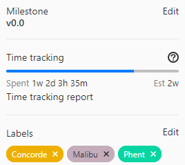
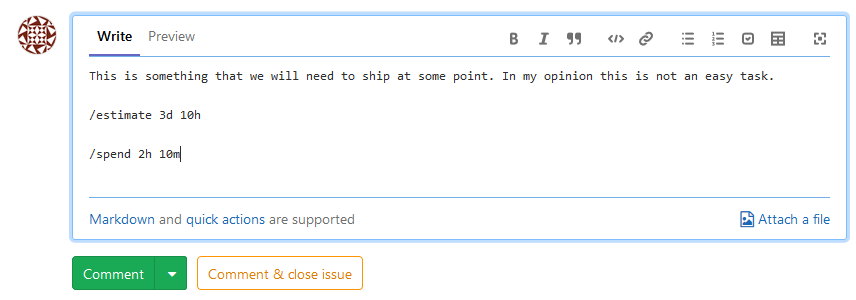
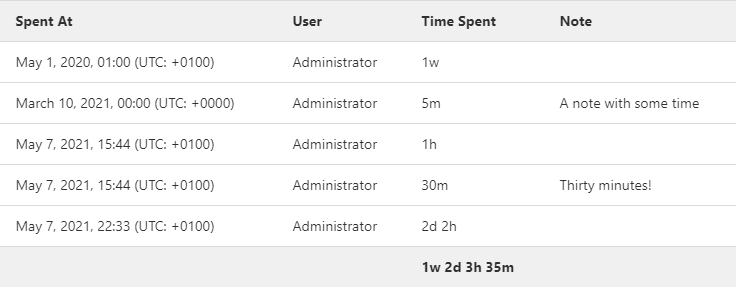

# Time tracking **(FREE)**

With time tracking you can track estimates and time spent on issues and merge
requests in GitLab.

Use time tracking for these tasks:

- Record the time spent working on an issue or a merge request.
- Add or update an estimate of the total time to complete an issue or a merge
request.
- View a breakdown of time spent working on an issue or a merge request.

You don't have to indicate an estimate to enter the time spent, and vice versa.

Data about time tracking shows up on the issue and merge request sidebar:

## How to enter data

Time tracking uses two [quick actions](quick_actions.md): `/spend` and `/estimate`.

If you use either quick action more than once in a single comment, only the last occurrence is applied.

Below is an example of how you can use those new quick actions inside a comment.

Adding time entries (time spent or estimates) is limited to project members
with [Reporter and higher permission levels](../permissions.md).

### Estimates

To enter an estimate, type `/estimate`, followed by the time.

For example, if you need to enter an estimate of 1 month, 2 weeks, 3 days, 4 hours, and 5 minutes,
type `/estimate 1mo 2w 3d 4h 5m`.
Check the [time units you can use](#configuration).

The estimate is designed to show the total estimated time. The estimated
time remaining is automatically calculated and displayed when hovering over
the time tracking information in the right sidebar.

An issue or a merge request can have only one estimate. Every time you enter a
new time estimate, it overwrites the previous value.

To remove an estimation entirely, use `/remove_estimate`.

### Time spent

To enter time spent, type `/spend`, followed by the time.

For example, if you need
to log 1 month, 2 weeks, 3 days, 4 hours, and 5 minutes, type `/spend 1mo 2w 3d 4h 5m`.
Check the [time units you can use](#configuration).

Every new time spent entry is added to the current total time spent for the
issue or the merge request.

To subtract time, enter a negative value. For example, `/spend -3d` removes three
days from the total time spent. You can't go below 0 minutes of time spent,
so if you remove more time than already entered, GitLab ignores the subtraction.

You can log time in the past by providing a date after the time.
For example, if you want to log 1 hour of time spent on the 31 January 2021,
you would type `/spend 1h 2021-01-31`. If you supply a date in the future, the
command fails and no time is logged.

To remove all the time spent at once, use `/remove_time_spent`.

## View a time tracking report

> [Introduced](https://gitlab.com/gitlab-org/gitlab/-/issues/271409) in GitLab 13.12.

You can view a breakdown of time spent on an issue or merge request.

Prerequisites:

- You must have at least the [Reporter role](../permissions.md#project-members-permissions) for a project.

To view a time tracking report, go to an issue or a merge request and select **Time tracking report**
in the right sidebar.

The breakdown of spent time is limited to a maximum of 100 entries.

## Configuration

The following time units are available:

| Time unit | What to type | Default conversion rate |
| --------- | ------------ | ----------------------- |
| Month     | `mo`         | 4w                      |
| Week      | `w`          | 5d                      |
| Day       | `d`          | 8h                      |
| Hour      | `h`          | 60m                     |
| Minute    | `m`          |                         |

### Limit displayed units to hours **(FREE SELF)**

> [Introduced](https://gitlab.com/gitlab-org/gitlab-foss/-/merge_requests/29469/) in GitLab 12.1.

In GitLab self-managed instances, you can limit the display of time units to
hours.
To do so:

1. On the top bar, select **Menu >** **{admin}** **Admin**.
1. On the left sidebar, select **Settings > Preferences**.
1. Expand **Localization**.
1. Under **Time tracking**, select the **Limit display of time tracking units to hours** checkbox.
1. Select **Save changes**.

With this option enabled, `75h` is displayed instead of `1w 4d 3h`.

## Related links

- [Time tracking solutions page](https://about.gitlab.com/solutions/time-tracking/)
- Time tracking GraphQL references:
  - [Connection](../../api/graphql/reference/index.md#timelogconnection)
  - [Edge](../../api/graphql/reference/index.md#timelogedge)
  - [Fields](../../api/graphql/reference/index.md#timelog)
  - [Timelogs](../../api/graphql/reference/index.md#querytimelogs)
  - [Group timelogs](../../api/graphql/reference/index.md#grouptimelogs)
  - [Project Timelogs](../../api/graphql/reference/index.md#projecttimelogs)
  - [User Timelogs](../../api/graphql/reference/index.md#usertimelogs)
